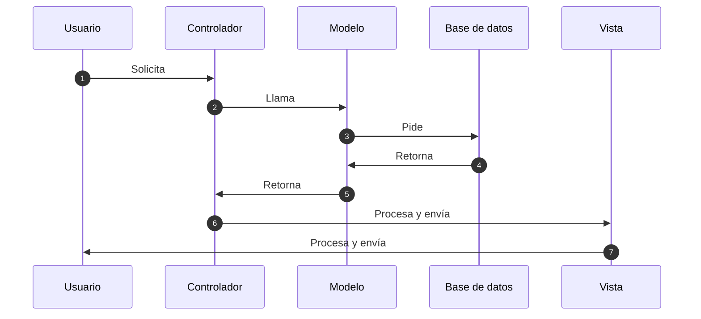
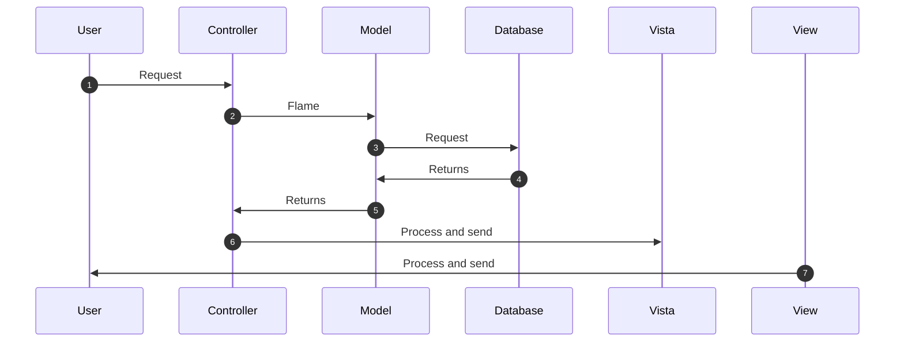

# CRUD_PHP

 CRUD en php, utilizando xampp con un servidor apache y mysql, con diseño en bootstrap 4
 CRUD in php, using xampp with an apache server and mysql, with bootstrap 4 design

    ## C-CREATE (CREAR)
    ## R-READ (LECTURA)
    ## U-UPDATE (ACTRUALIZAR)
    ## D-DELETE (BORRAR)

- Contenido/Contents
     - [DIAGRAMA-DIAGRAMS](#DIAGRAMA-DIAGRAMS)
     - [REQUISITOS-REQUIREMENTS](#REQUISITOS-REQUIREMENTS)
     - [BASEDEDATOS-DATABASE](#BASEDEDATOS-DATABASE)
     - [IMAGENES-IMAGES](#IMAGENES-IMAGES)
  

  ## DIAGRAMA-DIAGRAMS
[ES]

[ENG]

  ## REQUISITOS-REQUIREMENTS

> **Note:** Se quiere utilizar xampp - You need to use xampp.

##Pasos-Steps

- Pon la carpeta PHP en la ruta **C:\xampp\htdocs**
- Inicia el servidor **Apache** y el servidor **MySQL** en xampp
- En un navegador accede a la ruta **http://localhost/PHP/** para acceder a los proyectos y accede a **http://localhost/phpmyadmin/** para ver la base de datos

- Put the PHP folder in the path **C:\xampp\htdocs**
- Start the **Apache** server and **MySQL** server in xampp
- In a browser go to the path **http://localhost/PHP/** to access the projects and go to **http://localhost/phpmyadmin/** to see the database

  ## BASEDEDATOS-DATABASE

Para crear la base de datos necesitamos crear las siguientes tablas con sus especificaciones en phpmyadmin:

- Crear una base de datos llamada php en ella tendras que crear una tabla llamada registros
>IMPORTANTE: se debe tener el usuario root, sin contraseña y el servidor ha de ser localhost ejemplo:**mysql:host=localhost;dbname=php","root",""**

- En la tabla registros debemos crear las siguientes columnas con su correspondiente tipo de informacion:

To create the database we need to create the following tables with their specifications in phpmyadmin:

- Create a database called php in it you will have to create a table called records
>IMPORTANT: you must have the root user, without password and the server must be localhost example: **mysql: host = localhost; dbname = php "," root "," "**

- In the records table we must create the following columns with their corresponding type of information:

  ## IMAGENES-IMAGES

